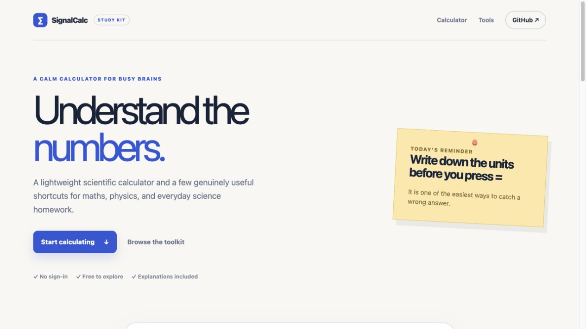
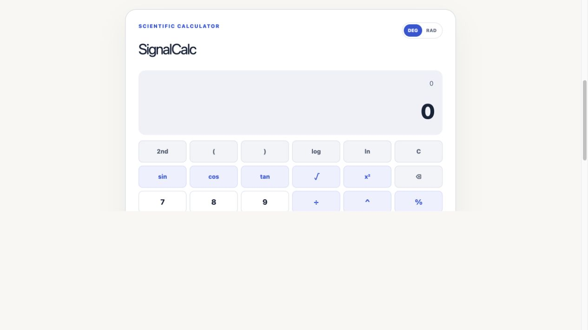

# SignalCalc Mobile





See the [SignalCalc showcase site](https://signalcalc-showcase.tim-o-finch.chatgpt.site) for the portfolio presentation and product overview. The deployment is currently owner-only.

[](https://expo.dev)
[](https://reactnative.dev/)
[](#running)
[](#license)
[](https://github.com/Peippo1)

SignalCalc is a lightweight, keyboard-friendly calculator with memory keys, history, safe expression parsing, and accessible UI inspired by the FinchWorks Studio design system.

## Features
- Memory keys: `MC`, `MR`, `M+`, `M-`, with live memory indicator
- History of last 5 calculations with expression + result
- Answer recall (`Ans`), percent, parentheses, sign toggle, and backspace support
- Long-press backspace to clear entry, haptics on press, copy result to clipboard
- Persists history/memory/ANS across sessions
- Dark, card-based layout with accent buttons and status pill
- Built on Expo and React Native with a single calculator entrypoint

## Project structure
```
App.js                # App root and safe-area provider
src/
  components/        # CalculatorButton and related UI pieces
  logic/             # useCalculator hook and safe expression evaluator
  screens/           # CalculatorScreen layout
__tests__/           # Hook and evaluator behavior tests
docs/
  finchworks-banner.png
```

## Architecture

```mermaid
flowchart TD
  App[App.js\nEntry point] --> Screen[CalculatorScreen\nUI Layout]
  Screen --> Button[CalculatorButton\nReusable UI Button]
  Screen --> Logic[useCalculator Hook\nState + Logic]
  Logic --> Mem[Memory System\nMC/MR/M+/M-]
  Logic --> Hist[History System\nLast 5 Calculations]
  Logic --> Eval[Safe Expression Evaluator\n(numbers, ops, parentheses)]
  Eval --> State[(React State)]
  State --> Screen
  App --> Assets[[Assets\nicons, banner]]
  App --> Expo[Expo Runtime\niOS • Android • Web]
```

## Prerequisites
- Node 18+ recommended
- Expo CLI: `npm i -g expo-cli` (optional, `npx expo` works too)

## Running
```bash
npm install
npx expo start
```
Then open the QR code (Expo Go), press `i` for iOS simulator, `a` for Android, or `w` for web.

## Key scripts
- `npm start` / `npx expo start` – launch Metro bundler
- `npm run android` / `npm run ios` / `npm run web` – run on a specific platform
- `npm run lint` – run ESLint across the active source tree


## MVP status

The MVP is complete and intentionally narrow: everyday arithmetic, memory, answer recall, local history, persistence, clipboard copy, haptics, accessibility labels, and iOS/Android/web support. There is no hosted backend, API key, analytics, or CI workflow to maintain.

## Notes
- `App.js` is the only app entrypoint and mounts `src/screens/CalculatorScreen`.
- History, memory, answer recall, and the current entry persist locally through AsyncStorage.

## How calculations work

The calculator uses a custom `useCalculator` hook which manages:

### Parsing & expression state
- Button presses append characters to an expression string
- Sanitisation prevents invalid sequences (e.g., `*/`, `..`, unmatched parentheses)

### Evaluation pipeline
1. Button state produces a small token expression.
2. A local tokenizer and shunting-yard parser apply precedence and parentheses.
3. Division by zero, malformed input, unsafe characters, and non-finite results return a recoverable error.
4. Successful results are formatted for display and added to the five-item history.

### History & memory
- History stores the last 5 successful calculations  
- Memory stores a single running number, updated via MC/MR/M+/M-  
- History and memory are persisted locally and restored on launch.

## License
MIT — see the full [LICENSE](LICENSE) file for details.
